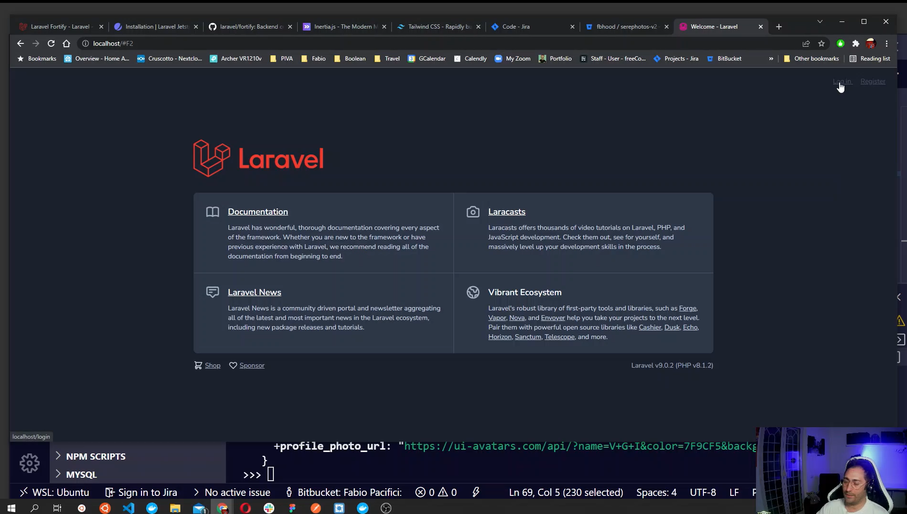
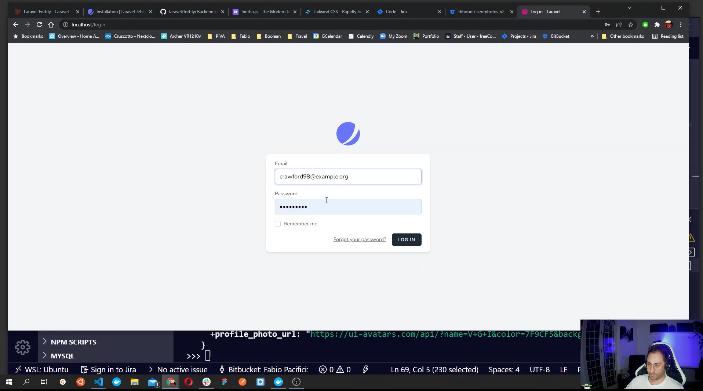
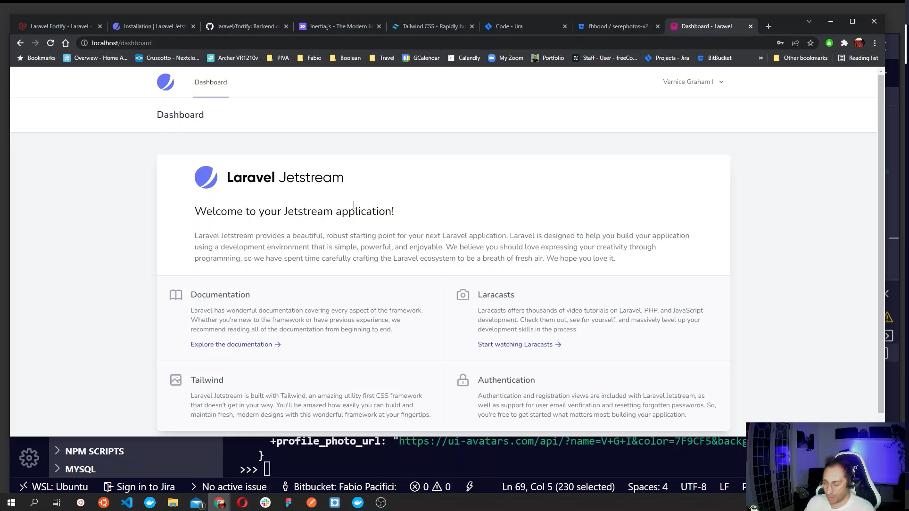

# How I Build a full-stack single page application live with Laravel 9 - Mysql - Vue and Docker

You will learn step by step the fundamentals of how to build a single page application using cutting edge technologies like Laravel 9, Vuejs 3, Mysql, Tailwind CSS and Doker.

## What do you need to follow this guide

A computer, how to install software and a basic understanding of HTML, CSS, Javascript, PHP.
This guide is organized into x chapters and is a part of a live coding series that is available [YouTube]

## Chapters

- What is Docker
- What is Mysql
- What is Laravel
- What is Laravel Sail
- What is Laravel Jetstream
- What is Vuejs
- What is Inertia
- What is Tailwind

## What is What

### Docker

>Docker is a set of platform as a service products that use OS-level virtualization to deliver software in packages called containers.
To semplify its concept, it is a way to package applications and dependencies in a container. A conteinerized application allows you can have a flexible development envronment so that you can run different applications without worring about dependencies, their requirements and conflicts between different versions. You can easily run an applications that for instance require two different versions of php and mysql.
Each team member can quicky reproduce the same environment of your application by simply runnting the same containers configuration.

[Documentation](https://www.docker.com/)

### Mysql

MySQL is an open-source relational database management system used to organize data into one or more tables with data that may be related with each others.

We need to store data somewhere and here is where MySQL comes into play.

[Documentation](https://www.mysql.com/)

### Laravel

Laravel is a free, open-source PHP web framework for the development of web applications following the model–view–controller architectural pattern and created by Taylor Otwell.

Laravel is an amazing php framework that you can use to create bespoke web applications.

[Documentation](https://laravel.com/)

### Laravel Sail

>Laravel Sail is a light-weight command-line interface for interacting with Laravel's default Docker development environment. Sail provides a great starting point for building a Laravel application using PHP, MySQL, and Redis without requiring prior Docker experience.

Usually, create a development environment to build such applications require the installation of softwares, languages and frameworks on your local machine and that is time consuming. Thanks to Docker and Laravel Sail we will be up and running in no time!

**Laravel Sail is supported on macOS, Linux, and Windows [via WSL2](https://docs.microsoft.com/en-us/windows/wsl/about).**

[Documentation](https://laravel.com/docs/9.x/sail)

### Laravel Jetstream

When building web applications it is likely that you want to let users register and log in to use your app. That is why we will use Jetstream.

>Laravel Jetstream is a beautifully designed application starter kit for Laravel and provides the perfect starting point for your next Laravel application.

It uses Laravel Fortify to implement all the back end authentication logic.

[Documentation](https://jetstream.laravel.com/2.x/introduction.html)

### Vuejs

Vue.js is an open-source model–view–viewmodel front end JavaScript framework for building user interfaces and single-page applications created by Evan You.

Vue is a fantastic framework that you can use as a stand alone to build single page applications but also with Laravel to build something amazing.

[Documentation]('https://vuejs.org/)

### Inertia JS

Inertia is the glue between laravel and Vuejs that we will use to build modern single page applications using classic server-side routing.

[Documentation]('https://inertiajs.com/)

### Tailwind

>A utility-first CSS framework packed with classes like flex , pt-4 , text-center and rotate-90 that can be composed to build any design, directly in your markup

Taiwind is a css framework that you can use to build your design.

## Machine Setup

To follow along during my live coding you will need to install docker desktop on your machine and if you are using windows you will also need to enable WSL in your system settings.
Visit the Docker [getting started page](https://www.docker.com/get-started) to install Docker Desktop.
If you are on Windows enable WSL2 by following this steps [here](https://docs.microsoft.com/en-us/windows/wsl/about)
If you have any trouble feel free to leave a comment or join my community on slack to get help.

## Laravel 9, Laravel Sail, Jetstram, Inertia and Vue3 - Live Coding

Laravel 9, Laravel Sail, Jetstream, Inertia and Vue3 - Live Coding

In this video, we will define a basic roadmap, install Laravel 9 with Laravel Sail, Run sail and build the containers. I will also take a tour of Laravel Sail overview and the sail commands. Then we will install Jetstream and scaffold Vue and Inertia files and have a look at the files and available features.
Next, we will populate our database and use the frontend provided by jet stream to register an account and log into a fresh Laravel application.
Finally, We will have a look at the Jetstream dashboard, the Inertia/Vue Components and then start playing around.
We will disable the registration, enable the Jetstream user profile picture feature and then add our first Inertia page where render some data taken from the database.

<https://youtu.be/c0ibec9dhZA>

If you are reading this article here are all the steps

### Laravel Installation with Sail

If you have successfully installed docker desktop in your machine we can open the terminal and install Laravel 9. Open a terminal window and browse to a folder where you want to keep your project then run the command below to download the latest Laravel files. The command will put all files inside a folder called my-example-app, you can tweak it as you like.

```bash
# Download laravel
curl -s "https://laravel.build/my-example-app" | bash
# Enter the laravel folder
cd my-example-app
```

### Deploy Laravel on Docker using the `sail up` command

With docker desktop up and running the next step is to start Laravel sail to build all the containers required to run our application locally.
Run the following command from the folder where all Laravel files have been downloaded

```bash
vendor/bin/sail up
```

It will take a minute then visit <http://localhost> and you should see your Laravel application.

If you run `sail up` and you get the following error it is likely that you need to update Docker Desktop.

```bash
ERROR: Service 'laravel.test' failed to build:
```

### Laravel Sail overview and the sail commands

With laravel sail installed, our usual Laravel commands have sligtly changed.
For instance, instead of running the Laravel artisan command using PHP like `php artisan` we now have to use sail, like so `sail artisan`.

The `sail artisan` command will return a list of all Laravel available commands.

Usually, when we work with Laravel, we also have to run `npm` and `composer` commands.
Again, we need to prefix our commands with `sail` to make them run inside the container.

Below a list of some commands you will likely have to run

```bash
# Interact with the database - run the migrations
sail artisan migrate # It was: php artisan migrate
# Use composer commands
sail composer require <packageName> # it was: composer require <packageName>
# Use npm commands
sail npm run dev # it was: npm run dev
```

You can read more on the sail documentation.

### Install Jetstream and scaffold Vue and Inertia

Let's now install the Laravel Jetstream authentication package and use the inertia scaffolding with vue3.

```bash
cd my-example-app
sail composer require laravel/jetstream 
```

Remember to prefix the composer command with `sail`

The command above has added a new command to Laravel, now we need to run it to install all the Jetstream components

```bash
sail artisan jetstream:install inertia
```

Next we need to compile all static assets with npm

```bash
sail npm install
sail npm run dev
```

Before we can actually see our application we will need to run the database migrations so that the session table, required by jetstream is present.

```bash
sail artisan migrate

```

Done! Jetstream is now installed in our application. If you visit `http://localhost`
in your browser you should see the laravel application with two links at the top to register and log in.



### Jetstream available features

### Populate the Database and create a user account

Before creating a new user let's have a quick look at the database configuration that laravel sail have created for us in the `.env` file.

```env
DB_CONNECTION=mysql
DB_HOST=mysql
DB_PORT=3306
DB_DATABASE=my-example-app
DB_USERNAME=sail
DB_PASSWORD=password
```

As you can see laravel sail configures everything we need to access the database container that is running on Docker. The `DB_DATABASE` is the name of the database and it is the same as the project folder. The is why in the previous step we have been able to run the `migrate` command without issues.

Since we already migrated all database tables we can now use the Laravel built-in User factory to create a new user then use its details to log in our user dashboard.

Let's open artisan tinker to interact with our application.

```bash
sail artisan tinker
```

The command above will open a command line interface that we can use to interact with our application. Let's create a new user.

```php
User::factory()->create()
```

The command above will create a new user and save its data in our database then it will render the user data onto the screen. Make sure to copy the user email so we can use it later to log in. Then exit by typing `exit;`.

The default password for every user created with a factory is `password`.

Let's visit the login page and access out application dashboard.



### Jetstream dashboard

After login you are redirected to the Jetstream dashboard, which looks amazing by default but we can customize it as we like, it is just starting point.



### Jetstream/Vue Components and Inertia Overview

The first thing you may notice after installing Jetstram is that there are a number of Vue components registered in out application. Not only that, also Inertia brings in Vue components. Moreover, use Inertia means that we need to get familiar also with it when defining routes.

The installation of Jetstream created inside the `resources/js` directory a number of subfolders where all our Vue components lives. There are not just simple components but also Pages components rendered by inertia as our Views.

The Jetstream inertia scaffolding created:

- `resources/js/Jetstream` Here we have 27 components used by Jetstream but, we can use then too if we want in our application.
- `resources/js/Layouts` In this folder there is the layout component used by inertia to render the dashboard page
- `resources/js/Pages` This is where we will place all our Pages (views) components. You will find the Dashboard page as well as the laravel Welcome page components here.

The power of inertia is mostly related about how it connects Vue and Laravel, letting us pass data (Database Models and more) as props to our Vue Pages components.

When you open the `routes/web.php` file you will notice that we no longer return a view but we use `Inertia` to render a Page component.

Let's examine the `/` homepage route that renders the Welcome component.

```php
Route::get('/', function () {
    return Inertia::render('Welcome', [
        'canLogin' => Route::has('login'),
        'canRegister' => Route::has('register'),
        'laravelVersion' => Application::VERSION,
        'phpVersion' => PHP_VERSION,
    ]);
});
```

It looks like our usual Route definition exept that in the closure we are returning an `\Inertia\Response` by calling the `render` method of the Inertia class. This method accepts two parameters, the first is a component, we passed the Welcome Page component, while the second parameter is an associative array, that will contain props to pass to the component. Here is where the magic happens.

Looking inside the Welcome component you will notice that in its script section we simply define four props matching with the keys of our associative array, than inertia will do the rest.

```vue
<script>
    import { defineComponent } from 'vue'
    import { Head, Link } from '@inertiajs/inertia-vue3';

    export default defineComponent({
        components: {
            Head,
            Link,
        },
        // 👇 Define the props 
        props: {
            canLogin: Boolean, 
            canRegister: Boolean,
            laravelVersion: String,
            phpVersion: String,
        }
    })
</script>
```

We can then just call the props inside the template. If you look at the template section you will notice that
`laravelVerion` and `phpVersion` were references in the code as you normally do with props.

```html
<div class="ml-4 text-center text-sm text-gray-500 sm:text-right sm:ml-0">
  Laravel v{{ laravelVersion }} (PHP v{{ phpVersion }})
</div>
```

The dashboard component is a little different. In fact it uses the Layout defined under `Layouts/AppLayout.vue` and uses the `Welcome` component to render the Dashboard page content, which is the same as the laravel Welcome page.

```vue

<template>
    <app-layout title="Dashboard">
        <template #header>
            <h2 class="font-semibold text-xl text-gray-800 leading-tight">
                Dashboard
            </h2>
        </template>

        <div class="py-12">
            <div class="max-w-7xl mx-auto sm:px-6 lg:px-8">
                <div class="bg-white overflow-hidden shadow-xl sm:rounded-lg">
                    <welcome /> 
                </div>
            </div>
        </div>
    </app-layout>
</template>

```

Inside the layout component you will notice the two inertia components `Head` and `Link`.
We can use the `Head` component to add head elements to our page, like meta tags, page title etc
While the `Link` component is a wrapper aroud a standard anchor tag that incercepts click events and prevent full page reload as you can read in the Inertia documentation.

[Link Component](https://inertiajs.com/links)
[Head Component](https://inertiajs.com/title-and-meta#head-component)


### Disable the registration feature

If you are following along, the next step i'll take is to disable one on the features Jetstream provides, register an account. To do that, we can navigate to `config/fortify.php` and comment out line 135 `Features::registration()` from the features array.

```php
'features' => [
        //Features::registration(),
        Features::resetPasswords(),
        // Features::emailVerification(),
        Features::updateProfileInformation(),
        Features::updatePasswords(),
        Features::twoFactorAuthentication([
            'confirmPassword' => true,
        ]),
    ],
```

If we visit the welcome page we will notice that the there is no `register` link and also the route is no longer listed when we run `sail artisan route:list`.

### Enable Jetstream user profile picture

Now let's try to enable the Jetstream feature called ProfielPhotos, that as you can guess will allow the user to add a profile picture.

To do that we need to visit `config/jetstream.php` and uncomment the line 59 `Features::profilePhoto`

```php
    'features' => [
        // Features::termsAndPrivacyPolicy(),
        Features::profilePhotos(),
        // Features::api(),
        // Features::teams(['invitations' => true]),
        Features::accountDeletion(),
    ],
```

If you log in you will notice that in the user profile a new section is available to upload a profile picture, however before doing anything else we need to run `sail artisan storage:link` so that laravel creates a symlink to the `storage/app/public` folder where we will save all user profile images.

Now try to visit the user profile and update the profile picture. If you get a 404 on the image this is because by default laravel sail assumes we are using laravel valet and sets the app url like so `APP_URL=http://my-example-app.test` in the `.env` file. Let's change it and use localhost instead.

```env
APP_URL=http://localhost
```

Now we should be good to go and see be able to see and change our profile image!🥳

### Add our first Inertia page and render records from the DB

Since we are rendering Vue components instead of blade views it is wise to start `sail npm run watch` to watch and recompile our Vue components as we create or edit them. Next let's add a new Photos page.

I will start by creating a new Route inside web.php

```php
Route::get('photos', function () {
    //dd(Photo::all());
    return Inertia::render('Guest/Photos');
});
```

In the code above I defined a new GET route and then rendered a componente that i will locate inside the `resources/js/Pages/Guest` and call it `Photos`. Let's create it.

Create a Guest folder

```bash
cd resources/js/Pages
mkdir Guest
cd Guest
touch Photos.vue
```

Then let's define a basic component

```vue
<template>
  <h1>Photos Page</h1>
</template>

```

If we visit `http://localhost/photos/` we will see our new page, cool! Let's copy over the page structure from the Welcome page so that we get the login and dashboard links as well.

The component will change to this

```vue
<template>
    <Head title="Phots" />

    <div class="relative flex items-top justify-center min-h-screen bg-gray-100 dark:bg-gray-900 sm:items-center sm:pt-0">
        <div v-if="canLogin" class="hidden fixed top-0 right-0 px-6 py-4 sm:block">
            <Link v-if="$page.props.user" :href="route('admin.dashboard')" class="text-sm text-gray-700 underline">
                Dashboard
            </Link>

            <template v-else>
                <Link :href="route('login')" class="text-sm text-gray-700 underline">
                    Log in
                </Link>

                <Link v-if="canRegister" :href="route('register')" class="ml-4 text-sm text-gray-700 underline">
                    Register
                </Link>
            </template>
        </div>

        <div class="max-w-6xl mx-auto sm:px-6 lg:px-8">
            <h1>Photos</h1>
            
        </div>
    </div>
</template>

<script>
    import { defineComponent } from 'vue'
    import { Head, Link } from '@inertiajs/inertia-vue3';

    export default defineComponent({
        components: {
            Head,
            Link,
        },

        props: {
            canLogin: Boolean,
            canRegister: Boolean,
          
        }
    })
</script>

```

The next step is to render a bounch of data onto this new page, for that we will build a Model and add some records to the database.

```bash
saild artisan make:model Photo -mfcr
```

This command creates a Model called Photo, plus a database migration table class, a factory and a resource controller.

Now let's define the database table inside the migration we just creted. Visit the `database/migrations` folder and you should see a file with a name similar to this `2022_02_13_215119_create_photos_table`, your will be sligly different.

Inside the migration file we can define a basic table like the following:

```php
 public function up()
    {
        Schema::create('photos', function (Blueprint $table) {
            $table->id();
            $table->string('path');
            $table->text('description');
            $table->timestamps();
        });
    }
```

For our table we defined just two new columns `path` and `description`, plus the `id`, `created_at` and `updated_at` that will be created by the $table->id()` and `$table->timestamps()` methods.

After the migration we will define a seeder and then run the migrations and seed the database.

At the top of the `database/seeders/PhotoSeeder.php` file we will import our Model and Faker

```php
use App\Models\Photo;
use Faker\Generator as Faker;
```

Next we will implement the run method using a for loop to create 10 records in the database.

```php


    public function run(Faker $faker)
    {
        for ($i = 0; $i < 10; $i++) {
            $photo = new Photo();
            $photo->path = $faker->imageUrl();
            $photo->description = $faker->paragraphs(2, true);
            $photo->save();
        }
    }

```

We are ready to run the migrations and seed the database.

```php

sail artisan migrate
sail artisan db:seed --class PhotoSeeder

```

We are now ready to show the data onto the `Guest/Photos`page component.
First update the route and pass a collection of Photos as props to the rendered component

```php
Route::get('photos', function () {
    //dd(Photo::all());
    return Inertia::render('Guest/Photos', [
        'photos' => Photo::all(), ## 👈 Pass a collection of photos as props to the component
        'canLogin' => Route::has('login'),
        'canRegister' => Route::has('register'),
    ]);
});

```

Second pass the prop to the props in the script section of the Guest/Photos component

```js

props: {
    canLogin: Boolean,
    canRegister: Boolean,
    photos: Array
}
```

Finally loop over the array and render all photos in the template section, just under the h1.

```html
<section class="photos">
    <div v-for="photo in photos" :key="photo.id" class="card" >
        
    </div>
</section>
```

Done! if you visit the `/photos` page you should see ten photos. 🥳

## How to refactor the admin dashboard and create new admin pages - Live coding

In this chapter we will Re-route the Jetstream dashboard, and make a route group for all admin pages. Then we will see how to add a new link to the dashboard and, add a new admin page. Finally we will take data a collection of data from the db and render them in a basic table. The default table isn't cool so for those reading this article, i decided to add a Tailwind table component.

### Re-route the Jetstream dashboard

If we look at the `config/fortify.php` file we notice that around line 64 there is a key called home which is calling the Home constant of the Route service provider.

This means that we can tweek  the constant and redirect the authenticated user to a different route. Lets go by steps:

- update the HOME Constant
- make a route group and redirect logged in users to `admin/` instead of '/dashboard'

Our application will have only a single user, therefore once it is logged in it is clearly the site admin so makes sense to redirect to an `admin` uri.

Change the HOME constant in `app/Providers/RouteServiceProvider.php` around line 20 to match the following

```php
public const HOME = '/admin';
```

### How to add Admin pages route group

Next let's update our route inside web.php we will change the route registered by Jetstream from this

```php
Route::middleware(['auth:sanctum', 'verified'])->get('/', function () {
        return Inertia::render('Dashboard');
    })->name('dashboard');
```

To this

```php
Route::middleware(['auth:sanctum', 'verified'])->prefix('admin')->name('admin.')->group(function () {

    Route::get('/', function () {
        return Inertia::render('Dashboard');
    })->name('dashboard');

    // other admin routes here
});

```

The route above is a route group that uses for all routes within the group the `auth:sanctum` middleware, a prefix of `admin` and add a `admin` suffix to each route name.

The end result is that we will be able to refer to the dashboard route by name, which now will be `admin.dashboard` and when we log in and will be redirected to the `admin` route our dashboard route will respond since it's uri is just `/` but the goup prefix will prefix every route in the group and make their uri starting with `admin`.

If you now run `sail artisan route:list` you will notice that the dashboard route has changed are we expected.

Before moving to the next step we need to update both the `/layouts/AppLayout.vue` and '/Pages/Welcome.vue` components.

Do you remeber that the dashboard route name is now `admin.dashboard` and not just `dashboard`?

Let's inspect the two components and update every reference of `route('dahsboard')` to this

```js
route('admin.dahsboard')
```

and also every reference of `route().current('dashboard')` to this

```js
route().current('admin.dashboard')
```

After all changes make sure to recompile the vue components and watch changes by running `sail npm run watch` then visit the home page to check if everything is working.

### How to add a new link to the dashboard

Now, to add a new admin page where list all photos stored in the database we need to add a new route the the group we created earlier. Let's hit the `web.php` file and make our changes.

In the Route group we will add a new route

```php
Route::middleware(['auth:sanctum', 'verified'])->prefix('admin')->name('admin.')->group(function () {

    Route::get('/', function () {
        return Inertia::render('Dashboard');
    })->name('dashboard');

    // 👇 other admin routes here 👇

    Route::get('/photos', function () {
        return inertia('Admin/Photos');
    })->name('photos');

});
```

In the new route above we used the `inertia()` helper function that does the same exact thing, return an Inertia/Response and render our Page component. We placed the component under an `Admin` folder inside `Pages` and we will call it `Photos.vue`.

Before we create the component let's add a new link to the dashboard that points to our new route.

Inside `AppLayout.vue`, find the `Navigation Links` comment and copy/paste the `jet-sav-link` component that is actually displaing a link to the dashboard and make it point to our new route.

You will end up having something like that

```html
<!-- Navigation Links -->
<div class="hidden space-x-8 sm:-my-px sm:ml-10 sm:flex">
    <jet-nav-link :href="route('admin.dashboard')" :active="route().current('admin.dashboard')">
        Dashboard
    </jet-nav-link>
      <jet-nav-link :href="route('admin.photos')" :active="route().current('admin.photos')">
        Photos
    </jet-nav-link>
</div>

```

If you visit `localhost/dashboard` and open the inspector you should see an error

```js
Error: Cannot find module `./Photos.vue`
```

It is fine, we haven't created the Photo page component yet, let's do it now!

### How to add a new Admin Page component

Make a file named `Photos.vue` inside `Pages/Admin` folder. Below the bash commands to create the folder and the file via terminal but you can do the same using your IDE graphical interface.

```bash
cd resources/js/Pages
mkdir Admin
touch Admin/Photos.vue
```

To make this new page look like the Dashboard page we will copy over its content. You should end up having something like that

```vue

<template>
  <app-layout title="Dashboard">
    <template #header>
      <h2 class="font-semibold text-xl text-gray-800 leading-tight">Photos</h2>
    </template>

    <div class="py-12">
      <div class="max-w-7xl mx-auto sm:px-6 lg:px-8">
        <div class="bg-white overflow-hidden shadow-xl sm:rounded-lg">
          <!-- All posts goes here -->
          <h1 class="text-2xl">Photos</h1>
           
        </div>
      </div>
    </div>
  </app-layout>
</template>

<script>
import { defineComponent } from "vue";
import AppLayout from "@/Layouts/AppLayout.vue";

export default defineComponent({
  components: {
    AppLayout,
  },
});
</script>

```

I removed from the Dashboard template few pieces so make sure to double check the code above. The `welcome` component was removed from the template as it is not required in this page and also its reference in the script section. The rest is identical.

Feel free to update the page title referenced as prop on the `<app-layout title="Dashboard">` component.

Now when you visit `localhost/admin` you can click on the Photos menu item and see our Photos page component content, not much for now, just an `h1`.

### Render records in the admin page as a table

Now it's time to render the data onto a table. To make things work let's first add our markup and fake that we already have access to an array of objects and loop over them inside our table than we will figure out how to make things work for real.

```html
 <table class="table-auto w-full text-left">
  <thead>
    <tr>
      <th>ID</th>
      <th>Photo</th>
      <th>Desciption</th>
      <th>Actions</th>
    </tr>
  </thead>
  <tbody>
    <tr v-for="photo in photos">
      <td>{{ photo.id }}</td>
      <td></td>
      <td>{{photo.description}}</td>
      <td>View - Edit - Delete</td>

    </tr>
  </tbody>
</table>

```

Ok, since we assumed that our component has access to a list of Photos let's pass a new prop to the component from the Route.

Update the route in web.php and pass to the `inertia()` function a second argument that will be an associative array that will be props. In it we will call `Photo::all` to have a collection to assign to a `photos` key

```php
Route::get('/photos', function () {
        return inertia('Admin/Photos', [
            'photos' => Photo::all()
        ]);
    })->name('photos');

```

To connect the props to our Page component we need to define the prop also inside the component.

```js
<script>
import { defineComponent } from "vue";
import AppLayout from "@/Layouts/AppLayout.vue";

export default defineComponent({
  components: {
    AppLayout,
  },
  /* 👇 Pass the photos array as a props 👇 */
  props: {
    photos: Array,
  },
});
</script>
```

#### Extra: Use a Tailwind table component

Tailwind is a css framework similar to bootstrap, there are a nuber of free to use components that we can grab from the documentation, tweek and use.

This table component is free and looks nice <https://tailwindui.com/components/application-ui/lists/tables>.

We can tweek the Photo page template and use the Tailwind table component to get a nice looking table like so.

```vue

<template>
    <app-layout title="Dashboard">
        <template #header>
            <h2 class="font-semibold text-xl text-gray-800 leading-tight">Photos</h2>
        </template>

         <div class="py-12">
            <div class="max-w-7xl mx-auto sm:px-6 lg:px-8">
              <!-- All posts goes here -->
              <h1 class="text-2xl">Photos</h1>
              <a class="px-4 bg-sky-900 text-white rounded-md" href>Create</a>
              <div class="flex flex-col">
                  <div class="-my-2 overflow-x-auto sm:-mx-6 lg:-mx-8">
                      <div class="py-2 align-middle inline-block min-w-full sm:px-6 lg:px-8">
                          <div class="shadow overflow-hidden border-b border-gray-200 sm:rounded-lg">
                              <table class="min-w-full divide-y divide-gray-200">
                                  <thead class="bg-gray-50">
                                      <tr>
                                          <th
                                              scope="col"
                                              class="px-6 py-3 text-left text-xs font-medium text-gray-500 uppercase tracking-wider"
                                          >ID</th>
                                          <th
                                              scope="col"
                                              class="px-6 py-3 text-left text-xs font-medium text-gray-500 uppercase tracking-wider"
                                          >Photos</th>
                                          <th
                                              scope="col"
                                              class="px-6 py-3 text-left text-xs font-medium text-gray-500 uppercase tracking-wider"
                                          >Description</th>
                                          <th scope="col" class="relative px-6 py-3">
                                              <span class="sr-only">Edit</span>
                                          </th>
                                      </tr>
                                  </thead>
                                  <tbody class="bg-white divide-y divide-gray-200">
                                      <tr v-for="photo in photos" :key="photo.id">
                                          <td class="px-6 py-4 whitespace-nowrap">
                                              <div
                                                  class="text-sm text-gray-900"
                                              >{{ photo.id }}</div>
                                          </td>

                                          <td class="px-6 py-4 whitespace-nowrap">
                                              <div class="flex items-center">
                                                  <div class="flex-shrink-0 h-10 w-10">
                                                      
                                                  </div>
                                              </div>
                                          </td>

                                          <td class="px-6 py-4 whitespace-nowrap">
                                              <div class="text-sm text-gray-900">
                                                {{ photo.description.slice(1, 100) + '...' }}
                                              </div>
                                          </td>

                                          <td class="px-6 py-4 whitespace-nowrap text-right text-sm font-medium">
                                              <a href="#" class="text-indigo-600 hover:text-indigo-900">
                                              View - Edit - Delete
                                              </a>
                                          </td>
                                      </tr>
                                  </tbody>
                              </table>
                          </div>
                      </div>
                  </div>
                </div>
            </div>
        </div>
    </app-layout>
</template>
```

## Conclusions

This is just an overviw of how I'd build a single page application using this technologies.
If you are familiar with server-side routing and Vuejs then you will enjoy bulding a single page application with Larave, Inertia and Vuejs. The learning curve isn't that high plus you have exhaustive documentations.

You can find the source code for this guide [here]() on my bitbucket account.
